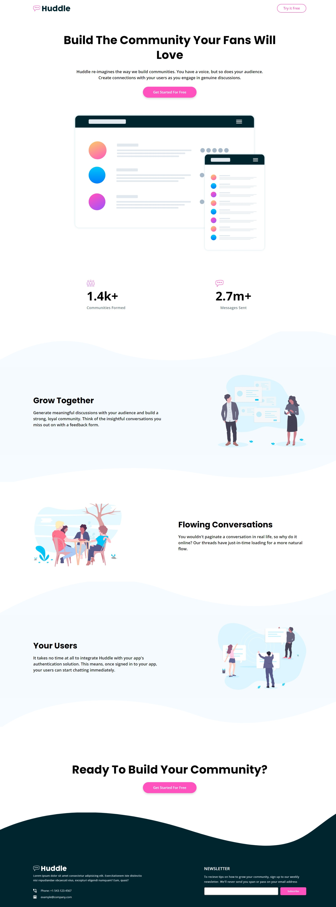

# Frontend Mentor - Huddle landing page with curved sections solution

This is a solution to the [Huddle landing page with curved sections challenge on Frontend Mentor](https://www.frontendmentor.io/challenges/huddle-landing-page-with-curved-sections-5ca5ecd01e82137ec91a50f2). Frontend Mentor challenges help you improve your coding skills by building realistic projects.

## Table of contents

- [Overview](#overview)
  - [The challenge](#the-challenge)
  - [Screenshot](#screenshot)
  - [Links](#links)
- [My process](#my-process)
  - [Built with](#built-with)
  - [What I learned](#what-i-learned)
  - [Continued development](#continued-development)
  - [Useful resources](#useful-resources)
- [Author](#author)
- [Acknowledgments](#acknowledgments)

## Overview

### The challenge

Users should be able to:

- View the optimal layout for the site depending on their device's screen size
- See hover states for all interactive elements on the page

### Screenshot

### Links

- Solution URL: [Solution](https://www.frontendmentor.io/solutions/responsive-landing-page-with-wavy-backgrounds-JCqDeGY41r)
- Live Site URL: [Live Site](https://luminous-dragon-7aa517.netlify.app/)

## My process

### Built with

- Mobile-first workflow
- Sass/Scss
- [React](https://reactjs.org/) - JS library

### What I learned

I learnt much better use of before and after pseudo elements. I also got to know a lot about background images and their properties

## Author

- Website - [Ali Bin Naseer](https://ibn-naseer.netlify.app/)
- Frontend Mentor - [@SaabK](https://www.frontendmentor.io/profile/SaabK)
- Twitter - [@AliBinTweets](https://twitter.com/AliBinTweets)
